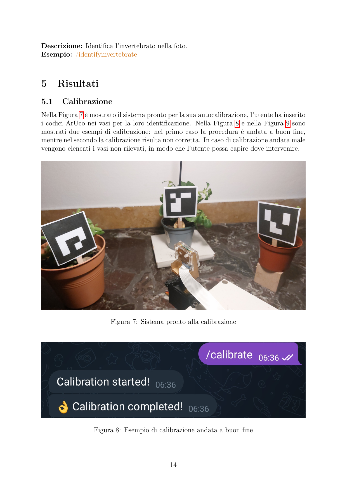
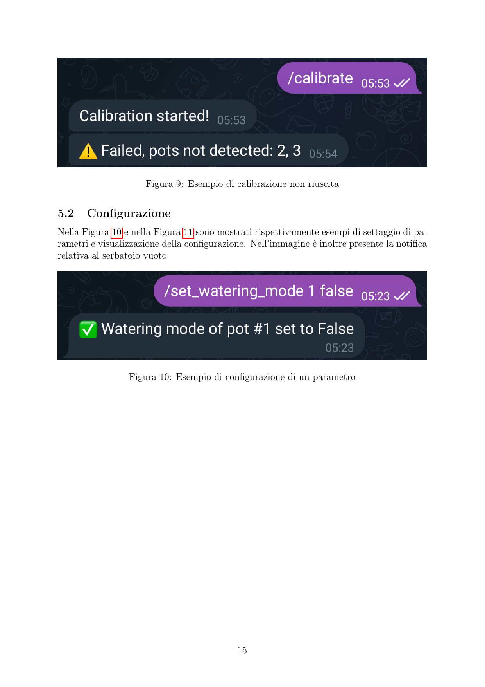
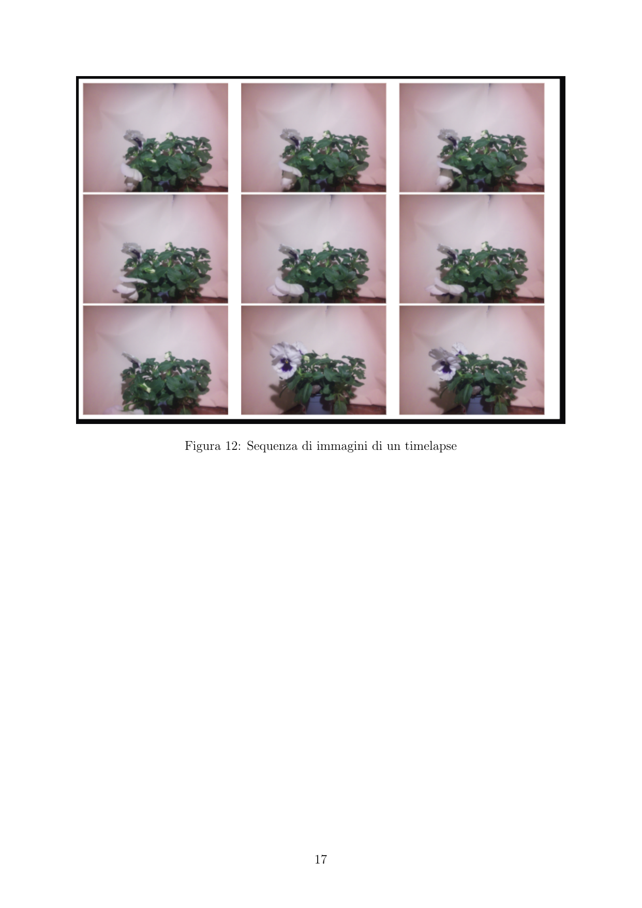
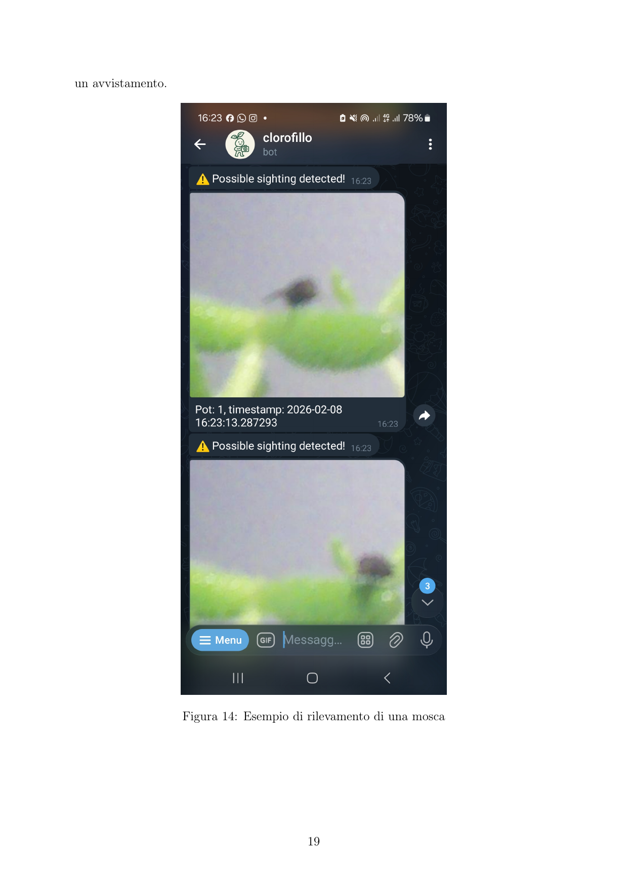
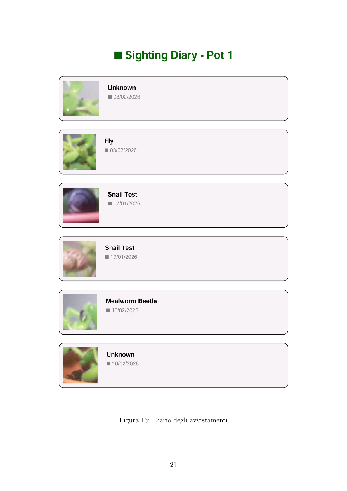
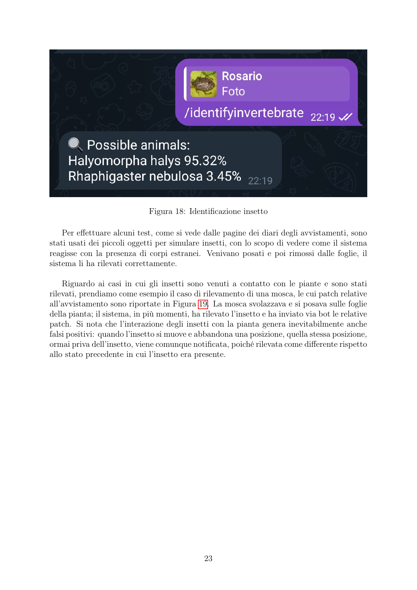

# Clorofillo

IoT system for automated watering, timelapse recording, and invertebrate detection

Project developed for University of Bologna Making course

## Installation

### Prerequisites

- Raspberry Pi with Ubuntu/Debian OS
- Python 3.11+
- Poetry package manager
- Git
- Telegram account
- Soldering iron and basic electronics knowledge (for hardware assembly)

### Installation Steps

#### 1. Clone Repository and Hardware Setup


 ```bash
# Clone the repository
git clone https://github.com/rosario-zaccone/clorofillo.git

# Navigate to project directory
cd clorofillo

# Switch to develop branch (optional, for latest features)
git checkout develop
 ```


1. **Read the electrical schematic**: Open `docs/report.pdf` for the complete wiring diagram
2. **Required components**:
   - Raspberry Pi (with GPIO pins)
   - 3x Water pumps
   - 1x Servo motor
   - 1x Camera module
   - 3x Humidity sensors (MCP3008 ADC)
   - 1x Water level sensor
   - GPIO relay modules
   - Jumper wires and breadboard

3. **Connection summary**:
   - Servo motor → GPIO pin 17 (SERVO_PIN)
   - Pump 1 → GPIO pin 4 (PUMP_ONE_PIN)
   - Pump 2 → GPIO pin 23 (PUMP_TWO_PIN)
   - Pump 3 → GPIO pin 24 (PUMP_THREE_PIN)
   - Humidity sensors → MCP3008 (analog channels 0, 1, 2)
   - Water level sensor → MCP3008 (analog channel 3)
   - Camera → Raspberry Pi camera port

**Important**: Double-check all connections against `docs/report.pdf` before powering on.

#### 2. Get Telegram Bot Token

1. Open Telegram and search for `@BotFather`
2. Send `/newbot` command
3. Follow the instructions to create a bot
4. Copy the token (format: `123456:ABC-DEF...`)

#### 3. Install Dependencies

 ```bash
# Install Poetry (if not already installed)
curl -sSL https://install.python-poetry.org | python3 -

# Navigate to project directory
cd clorofillo

# Install dependencies
poetry install
 ```

#### 4. Configure Environment Variables

 ```bash
# Copy example file
cp .env.example .env

# Edit with your values
nano .env
 ```


| Variable | Description | Example |
|----------|-------------|---------|
| `TELEGRAM_TOKEN` | Bot token from @BotFather | `123456:ABC-DEF...` |
| `SERVO_PIN` | GPIO pin for servo motor | `17` |
| `PUMP_ONE_PIN` | GPIO pin for pump 1 | `4` |
| `PUMP_TWO_PIN` | GPIO pin for pump 2 | `23` |
| `PUMP_THREE_PIN` | GPIO pin for pump 3 | `24` |
| `FLOW_RATE` | Pump flow rate (L/s) | `0.05` |
| `CALIB_DIR` | Calibration photos directory | `data/calibration` |
| `PATCH_DIR` | invertebrate patch directory | `data/photos/sighting/patch/` |
| `TIMELAPSE_DIR` | Timelapse videos directory | `data/timelapses/` |

#### 5. Initialize Database

 ```bash
poetry run python tests/seed.py
 ```

This creates:
- SQLite database at `data/db.sqlite`
- 3 example plant pots with default configurations
- Timelapse shot schedules

#### 6. Setup Systemd Services

 ```bash
# Make setup script executable
chmod +x scripts/setup_services.sh

# Run setup (creates and enables services)
sudo bash scripts/setup_services.sh
 ```

This script:
- Creates `clorofillo.service`
- Creates `pigpiod.service`
- Enables auto-start on boot
- Optionally starts services immediately

#### 7. Configure WiFi (Raspberry Pi)

 ```bash
sudo nano /etc/wpa_supplicant/wpa_supplicant.conf
 ```

Add:
 ```conf
country=IT
ctrl_interface=DIR=/var/run/wpa_supplicant GROUP=netdev
update_config=1

network={
    ssid="your_wifi_ssid"
    psk="your_wifi_password"
    key_mgmt=WPA-PSK
}
 ```

Save and exit (Ctrl+X, Y, Enter).

#### 8. Reboot Raspberry Pi

 ```bash
sudo reboot
 ```

The system will automatically:
1. Check internet connection (max 30 attempts)
2. Start `pigpiod` daemon
3. Start Telegram bot

## First Use - Telegram Bot

### Initial Commands

 ```
/start       → Authorize your chat with the bot
/help        → Show help and keyboard
/info        → Display all available commands
/startio     → Start hardware + invertebrate detection
 ```

### Common Commands

 ```
/settings <pot_id>
→ Show pot configuration
→ Example: /settings 1

/set_settings <pot_id> <watering_mode> <threshold> <shot_freq> <sighting_freq> <position> <plant> <size>
→ Update pot configuration
→ Example: /set_settings 1 true 55 08:00,20:00 5 90 Tomato 4.5

/timelapse <pot_id> <from YYYY-MM-DD> <to YYYY-MM-DD> <fps> <filter>
→ Create timelapse video
→ Filters: none | bw | saturation | contrast | white_balance
→ Example: /timelapse 1 2025-01-01 2025-01-31 24 none

/calibrate
→ Start camera and servo calibration

/diary <pot_id>
→ Download sighting diary PDF

/killio
→ Stop hardware (io_app.py)
 ```

## Useful Commands

### Check Service Status

 ```bash
sudo systemctl status clorofillo.service
sudo systemctl status pigpiod.service
 ```

### View Live Logs

 ```bash
journalctl -u clorofillo.service -f
journalctl -u pigpiod.service -f
 ```

### Restart Services

 ```bash
sudo systemctl restart clorofillo.service
sudo systemctl restart pigpiod.service
 ```

### Stop/Start Services

 ```bash
sudo systemctl stop clorofillo.service
sudo systemctl start clorofillo.service
 ```

## Project Structure

 ```
clorofillo/
├── .env                          # Configuration (create from .env.example)
├── .env.example                  # Template
├── docs/
│   └── report.pdf                # Electrical schematic and hardware documentation
├── scripts/
│   ├── start.sh                   # Main startup script
│   ├── start_io.sh                # Start hardware + photos
│   ├── kill_io.sh                 # Stop hardware
│   ├── stop.sh                   # Stop bot and IO processes
│   └── setup_services.sh          # Systemd setup script
├── pyproject.toml                 # Dependencies
├── data/
│   ├── db.sqlite                  # Database (auto-created)
│   ├── calibration/               # Calibration photos
│   └── photos/
│       ├── timelapse/             # Timelapse photos
│       ├── sighting/patch/        # Detected invertebrate patches
│       └── comparison/            # ML comparison images
└── src/clorofillo/
    ├── app.py                     # Telegram bot
    ├── io_app.py                  # Hardware control + AI
    ├── model/                     # Domain models
    ├── service/                   # Business logic
    └── persistence/               # Repositories + ORM
 ```

## Redis Communication Protocol

### Raspberry Pi → Bot (rasp_to_bot)

| Code | Message | Description |
|------|---------|-------------|
| `1` | Empty tank | Water reservoir is empty |
| `2` | Calibration OK | Camera/servo calibration completed successfully |
| `3\|<error>` | Calibration failed | Calibration error with details |
| `4` | invertebrate detected | Possible sighting detected in photos |

### Bot → Raspberry Pi (bot_to_rasp)

| Code | Action | Description |
|------|--------|-------------|
| `1` | Start calibration | Initiate camera and servo calibration |


## Results

The full report is available in [docs/report.pdf](docs/report.pdf).

### Autocalibration



### Notifications



### Timelapse



### Insect Detection






